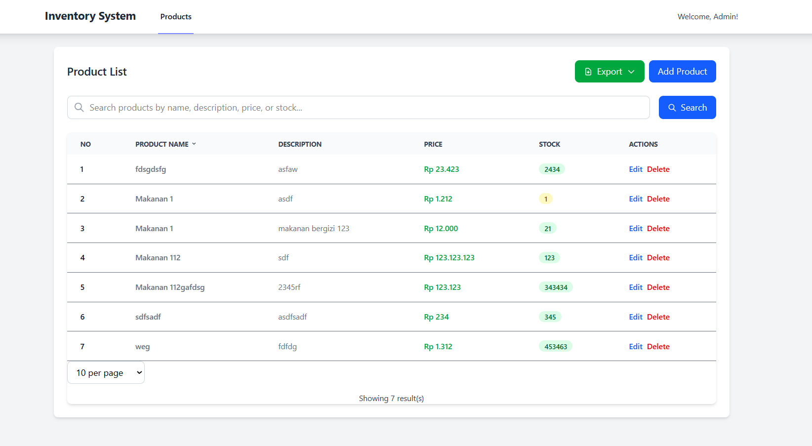

1. **Clone Repository**

    ```bash
    git clone https://github.com/abdurFaiz/bnsp-project.git
    cd invent-system
    ```

2. **Install Dependency**

    ```bash
    composer install
    npm install
    ```

3. **Copy File Environment**

    ```bash
    cp .env.example .env
    ```

4. **Generate Key**

    ```bash
    php artisan key:generate
    ```

5. **Atur Konfigurasi Database**  
   Edit file `.env` dan sesuaikan bagian berikut:

    ```
    DB_DATABASE=nama_database
    DB_USERNAME=username_db
    DB_PASSWORD=password_db
    ```

6. **Migrasi Database**

    ```bash
    php artisan migrate
    ```

7. **Jalankan Server**
    ```bash
    php artisan serve
    npm run dev
    ```
    Akses aplikasi di [http://localhost:8000](http://localhost:8000)

8. Folder Docs berisi = Activity Diagram
---

# Panduan Pengguna - Aplikasi Manajemen Produk

Panduan ini akan membantu Anda memahami cara menggunakan berbagai fitur yang tersedia di dalam aplikasi.

## Daftar Isi
- [Melihat Daftar Produk](#melihat-daftar-produk)
- [Mencari Produk](#mencari-produk)
- [Menambah Produk Baru](#menambah-produk-baru)
- [Mengubah Data Produk](#mengubah-data-produk)
- [Menghapus Produk](#menghapus-produk)
- [Mengekspor Data ke PDF](#mengekspor-data-ke-pdf-excel)

---

## Melihat Daftar Produk
Saat pertama kali membuka aplikasi, Anda akan melihat halaman utama yang menampilkan semua produk dalam bentuk tabel. Jika jumlah produk melebihi 10, akan muncul navigasi halaman di bagian bawah tabel untuk melihat produk lainnya.


## Mencari Produk
Untuk menemukan produk secara cepat, gunakan fitur pencarian yang terletak di atas tabel.
1. Ketikkan nama produk yang ingin Anda cari di kolom pencarian.
2. Klik tombol **Search**.
3. Tabel akan secara otomatis menampilkan produk yang sesuai dengan pencarian Anda.
4. Terdapat juga sort data di masing - masing header table


## Menambah Produk Baru
1. Klik tombol **Create Product** yang berada di bagian atas halaman.
2. Anda akan diarahkan ke halaman form untuk menambah produk.
3. Isi informasi produk yang diperlukan:
    - **Name**: Nama produk
    - **Price**: Harga produk
    - **Description**: Deskripsi singkat mengenai produk
    - **Stock**: Jumlah stok produk yang tersedia
4. Klik tombol **Save** untuk menyimpan produk baru. Produk tersebut akan langsung muncul di tabel daftar produk.


## Mengubah Data Produk
1. Pada tabel daftar produk, cari produk yang ingin Anda ubah.
2. Klik tombol **Edit** pada baris produk tersebut.
3. Sebuah form akan muncul dengan data produk yang sudah terisi.
4. Ubah data sesuai kebutuhan, lalu klik tombol **Update** untuk menyimpan perubahan.


## Menghapus Produk
1. Pada tabel daftar produk, cari produk yang ingin Anda hapus.
2. Klik tombol **Delete** pada baris produk tersebut.
3. Akan muncul konfirmasi untuk memastikan Anda benar-benar ingin menghapus produk.
4. Setelah dikonfirmasi, produk akan dihapus dari daftar. (Catatan: Produk tidak dihapus permanen dan masih bisa dikembalikan oleh administrator).


## Mengekspor Data ke PDF
Aplikasi ini memungkinkan Anda untuk mengunduh data produk dalam format PDF.


## Mengekspor Data ke EXCEL
Aplikasi ini memungkinkan Anda untuk mengunduh data produk dalam format excel


---

**Catatan:**
-   Semua fitur utama dapat diakses dari halaman utama aplikasi.
-   Fitur hapus menggunakan *soft delete*, yang berarti data tidak langsung hilang permanen.

# Tabel Pengujian Aplikasi Manajemen Produk

| No. | Fitur                    | Skenario Pengujian                                 | Data Uji                                                                 | Langkah-langkah                                                                            | Hasil yang Diharapkan                                       | Hasil Pengujian | Status   |
| :-- | :----------------------- | :------------------------------------------------- | :----------------------------------------------------------------------- | :----------------------------------------------------------------------------------------- | :---------------------------------------------------------- | :-------------- | :------- |
| 1.  | Melihat Daftar Produk    | Menampilkan semua produk                           | -                                                                        | 1. Buka aplikasi. <br> 2. Lihat tabel produk.                                              | Tabel menampilkan semua produk yang ada di database.        | Sesuai          | Berhasil |
| 2.  | Mencari Produk           | Mencari produk berdasarkan nama                    | Nama: "Produk A"                                                         | 1. Ketik "Produk A" di kolom pencarian. <br> 2. Klik tombol "Search".                      | Tabel hanya menampilkan produk dengan nama "Produk A".      | Sesuai          | Berhasil |
| 3.  | Menambah Produk Baru     | Menambahkan produk baru dengan data valid          | Nama: "Produk Baru", Harga: 10000, Deskripsi: "Deskripsi baru", Stok: 10 | 1. Klik "Create Product". <br> 2. Isi form. <br> 3. Klik "Save".                           | Produk baru berhasil ditambahkan dan muncul di tabel.       | Sesuai          | Berhasil |
| 4.  | Mengubah Data Produk     | Mengubah data produk yang sudah ada                | Nama: "Produk Edit", Harga: 12000                                        | 1. Klik "Edit" pada salah satu produk. <br> 2. Ubah data pada form. <br> 3. Klik "Update". | Data produk berhasil diubah sesuai dengan input baru.       | Sesuai          | Berhasil |
| 5.  | Menghapus Produk         | Menghapus produk dari daftar                       | -                                                                        | 1. Klik "Delete" pada salah satu produk. <br> 2. Konfirmasi penghapusan.                   | Produk hilang dari daftar (soft delete).                    | Sesuai          | Berhasil |
| 6.  | Mengekspor Data ke PDF   | Mengunduh daftar produk dalam format PDF           | -                                                                        | 1. Klik "Export PDF".                                                                      | File PDF berisi data produk berhasil terunduh.              | Sesuai          | Berhasil |
| 7.  | Mengekspor Data ke Excel | Mengunduh daftar produk dalam format Excel         | -                                                                        | 1. Klik "Export Excel".                                                                    | File Excel berisi data produk berhasil terunduh.            | Sesuai          | Berhasil |
| 8.  | Validasi Form            | Mengisi form tambah produk dengan data tidak valid | Harga: "abc" (bukan angka)                                               | 1. Klik "Create Product". <br> 2. Isi harga dengan teks. <br> 3. Klik "Save".              | Muncul pesan error validasi bahwa harga harus berupa angka. | Sesuai          | Berhasil |
| 9.  | Paginasi                 | Navigasi halaman jika produk lebih dari 10         | -                                                                        | 1. Tambahkan lebih dari 10 produk. <br> 2. Klik navigasi halaman di bawah tabel.           | Pindah ke halaman produk berikutnya.                        | Sesuai          | Berhasil |
| 10. | Sortir Data              | Mengurutkan data berdasarkan kolom                 | Klik header kolom "Name"                                                 | 1. Klik pada header tabel "Name".                                                          | Data diurutkan berdasarkan nama produk (A-Z atau Z-A).      | Sesuai          | Berhasil |
